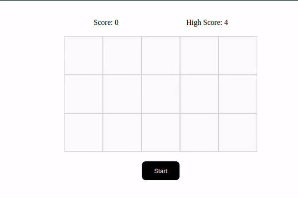

<div style="display:flex; align-items: center; justify-content: space-between">
<h3 align="center">Memory Game</h3>
<a align="right" href="https://memory-game-vanillajs.netlify.app/">
            Play here
</a>
</div>



<div align="center">
    <p align="center">
        This is a basic memory game based on blinking blocks. Random blocks will blink and the player has to mark the blinked blocks in correct sequence. If correct, the score increases by 1 and the game continues with increasing number of blinking blocks. 
        <br/>
        <br/>
        <small>This project is built purely for practice in JavaScript</small>
        <br />
    </p>
    <div align="center">
        <a href="https://github.com/abhishekc98/memory-game-vanilla-js/issues">
            Report bugs / Request Feature
        </a>
    </div>    
</div>

<br/>
<br/>

### Installation

1. Clone the repo
   ```sh
   git clone https://github.com/abhishekc98/memory-game-vanilla-js.git
   ```
2. Install NPM packages
   ```sh
   npm install
   ```
3. Run locally
    ```sh
    npm run dev
    ```

